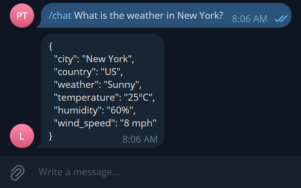

# Telegram JSON Bot

## Overview
This project is a Telegram bot that integrates with the OpenAI API to retrieve data based on user requests and return the data in a formatted JSON response within Telegram.

## Features
- Ability to process user requests through Telegram messages.
- Returns data as JSON, making it versatile for various applications.

## Requirements
- Python 3.8+
- `python-telegram-bot` library
- `openai` library
- `dotenv` module for environment variable management

## Getting Started

### Setting Up Telegram Bot
1. Visit [BotFather](https://t.me/BotFather) on Telegram.
2. Follow the instructions to create a new bot. Upon completion, you will receive a Telegram API key.

### OpenAI API Key
Ensure that you have an OpenAI account and access to an API key. Visit [OpenAI's website](https://openai.com/api/) for more information on obtaining an API key.

### Installation

Clone the repository to your local machine:

```
git clone [Your Repository URL]
```

Then, install the required dependencies:

```
pip install -r requirements.txt
```

## Configuration

1. Create a `.env` file in the root directory.
2. Add your Telegram bot token and OpenAI API key:

   ```
   TG_BOT_TOKEN=your_telegram_bot_token
   OPENAI_API_KEY=your_openai_api_key
   ```

## Usage

Run the bot with:

```
python main.py
```

In Telegram, use the following commands:
- `/start` - Initializes the bot.
- `/chat [Your message]` - Sends a message to the bot, which uses OpenAI's model to generate a response.

## Contributing
Contributions to this project are welcome. Please ensure that your pull requests are well-documented.

## License
This project is licensed under [Your License Name]. See the LICENSE file for more details.
